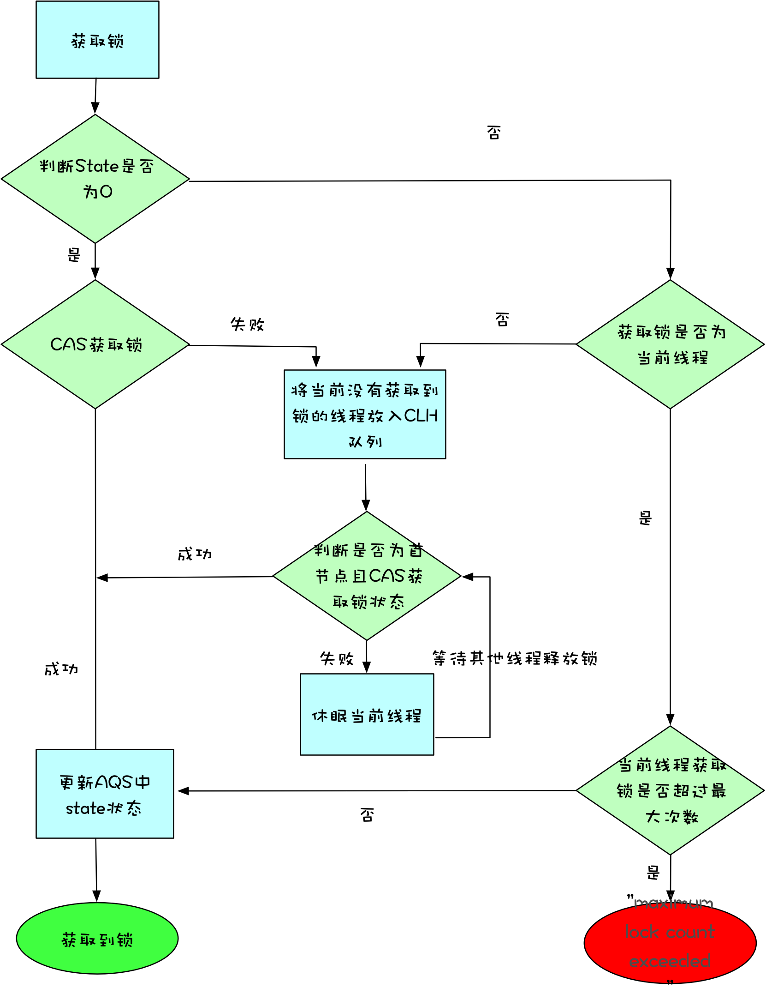

# 技术分享
## 并发编程抽象问题
* 原子性问题
* 可见性问题
* 有序性问题

## 并发问题万能钥匙 ->锁
* synchronized
    * 加锁原理
    

    * 锁升级过程
    

        * 高并发情况下因为撤销偏向锁会发生STW影响性能 （hotspot文档也指出撤销一定次数后会被禁用）
                     `-XX:-UseBiasedLocking // 关闭偏向锁（默认打开）`
                     `-XX:+UseHeavyMonitors  // 设置重量级锁` 
        * 锁竞争激烈情况下自旋锁占用CPU增加性能开销
                    `-XX:-UseSpinning // 参数关闭自旋锁优化 (默认打开) `
                    `-XX:PreBlockSpin // 参数修改默认的自旋次数。JDK1.7后，去掉此参数由jvm控制`
    * 实现等待通知模式
* Lock
    * ReentrantLock执行原理
    

    * 实现条件队列
    * ReentrantReadWriteLock执行原理
    

    * ReentrantReadWriteLock使用

* 二者对比

|  | Synchronized | Lock |
| --- | --- | --- |
| 实现方式 | JVM层实现 | Java层实现 |
| 锁获取  | JVM隐式获取 | Lock.lock();Lock.tryLock();Lock.tryLock(long timeout,TimeUnit unit);Lock.lockInterruptibly()|
| 锁释放 | JVM隐式释放 | Lock.unlock(); finally块中释放 |
| 锁类型 | 非公平锁、可重入  | 非公平锁、公平锁、可重入 |
| 锁状态 |  不可中断|可中断

## 动态编译实现锁消除/锁粗化
* 锁消除->逃逸分析判断锁对象是否只能被一个线程访问，从而决定是否生成synchronized对应机器码（例如局部变量）
* 锁粗化->相邻同步块使用的是同一个锁实例，则JIT会做合并，避免反复申请、释放相同锁的开销

## 减小锁粒度、减少锁持有时间
* 1.7 ConcurrentHashMap Segment
* 减少锁持有时间增加自旋成功率